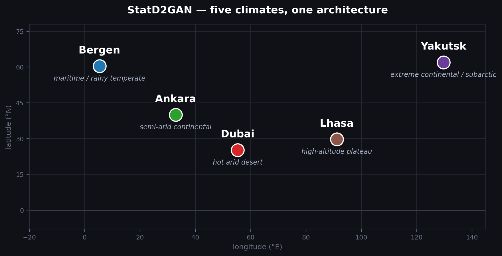

# 🌦️ StatD2GAN

**A multi-discriminator GAN for synthetic multivariate weather sequences and a
held-out re-evaluation that overturns most of its own architecture claims.**

> 📝 Status: preprint in preparation, target venue Neurocomputing (Elsevier).
> 📜 License: [MIT](LICENSE)

## 📖 What this is

StatD2GAN generates synthetic hourly weather sequences (temperature, dew point,
pressure, wind, humidity, VPD) using an LSTM generator trained against three
discriminator heads a raw-sequence critic, a distributional critic, and a
marginal/copula-structure critic combined with post-hoc isotonic calibration
and a physics-consistency loss.

The project did not end up being an architecture paper. Under a corrected,
held-out evaluation protocol, most of the components originally motivating the
design turned out to contribute nothing measurable, and the calibration step
that was meant to *improve* fidelity was found to be *masking* it. The paper
is a protocol-correction and component-analysis study; this repository is the
code behind it, including the ablation arms that produced the null results.

## 🗺️ Locations

Five climates chosen to span temperature range, aridity, altitude, and
seasonal variability a component that helps in one climate and not another
is exactly the kind of effect a single-location study would miss.



*(Schematic longitude/latitude plot, not a surveyed map it exists to show
climate spread at a glance.)*

| City | Country | Climate archetype | Why it's in the panel |
| --- | --- | --- | --- |
| 🌊 Bergen | 🇳🇴 Norway | Maritime, high precipitation | Wet, mild, low seasonal temperature swing |
| ❄️ Yakutsk | 🇷🇺 Russia | Extreme continental / subarctic | Widest annual temperature range of any inhabited city on Earth |
| 🌤️ Ankara | 🇹🇷 Türkiye | Semi-arid continental | Moderate baseline, home turf for the ERA5 pipeline |
| ⛰️ Lhasa | 🇨🇳 China (Tibet) | High-altitude plateau | Low pressure, high diurnal swing, thin-air humidity dynamics |
| 🏜️ Dubai | 🇦🇪 UAE | Hot arid desert | Extreme heat, near-zero humidity for long stretches |

## 🏆 Headline findings (locked, Holm-corrected)

1. **Calibration saturates the evaluation metric.** Post-hoc isotonic
   calibration drives KS sup-distance down to the real-vs-real noise floor
   (ratio 1.00–1.02) across all five climates meaning a calibrated pooled
   KS score cannot discriminate a well-trained model from a poorly-trained
   one. This is the paper's most transferable result.
2. **`D_sorted` is the only architectural component with a significant
   effect** (Kendall tau MAE, Δτ = +0.080, p = 0.009 after Holm correction),
   and the effect is climate-dependent negligible in Ankara, >115% in
   Dubai and Yakutsk.
3. **The mechanism is quantile supervision, not copula structure.** A
   soft-rank variant of the same discriminator (`rank_D_sort`) isolates
   which channel is doing the work.
4. **Physics violations are injected by calibration, not by the generator.**
   A marginal-independent isotonic map introduces constraint violations that
   a hard post-hoc projection removes at ≤0.003 KS cost.
5. **Seven of nine other architectural components are null results**:
   `D_temporal`, the LSTM- vs. moment-based `D_stat` variants, the auxiliary
   CDF/quantile losses, and evolutionary discriminator-weighting are all
   statistically indistinguishable from the ablated baseline once evaluated
   held-out across 25 matched (location, seed) pairs.
6. **Pooled metrics are blind to variance collapse.** TimeGAN matches
   pooled-metric performance but its seasonal diversity collapses
   (`seq_mean_sd ≈ 0` vs. 5–21°C for real data); RCGAN serves as a negative
   control. Sequence-level diagnostics were necessary to catch this at all.

Everything above is computed from paired Wilcoxon signed-rank tests over 25
(location, seed) pairs with Holm correction within each metric family see
[`src/statd2gan/analysis.py`](src/statd2gan/analysis.py).

### 🚫 Retracted / invalid not used anywhere in the paper or this code

The following appeared in an earlier (pre-held-out) campaign and are
superseded: any climate-dependent "specialization" narrative, a claimed
`D_temporal` trade-off, a claimed calibration cost to Kendall tau (this was
run-to-run noise, |Δτ| ≈ 0.085), a "lambda insurance" effect for evolutionary
weighting (p = 0.50 under the corrected test), a copula-protection claim for
`D_sorted`, old effect sizes, KS *pass-rate* as a headline metric, and old
RCGAN/TimeGAN numbers including a discriminative score of 0.500. If you find
any of these in a fork or an old notebook, they do not reflect the current
protocol.

## 🧪 Evaluation protocol (v2)

- **Split**: final 2 full calendar years held out per location, with a
  168-hour embargo at the boundary so no windowed sequence straddles train
  and validation.
- **Calibration**: the isotonic quantile map is always fit on train and
  applied to synthetic data evaluated against validation never fit on the
  data it is scored against.
- **Primary metric**: KS sup-distance (sample-size-independent effect size).
  KS pass rate is retained only as a secondary, fixed-subsample diagnostic.
- **Dependence**: Kendall tau MAE over a fixed 50k-pair subsample.
- **Temporal structure**: ACF computed per sequence, then averaged never
  on a flattened array (which would hide within-sequence structure).
- **Physics**: an indicator-function violation rate, using the exact same
  thresholds in the training loss and the evaluation metric.
- **Evidence unit**: 25 matched (location, seed) pairs per contrast, tested
  with paired Wilcoxon + Holm correction within each metric family.
- **Noise floor**: run-to-run noise on Kendall tau MAE is ≈0.085 between
  identically configured runs differing only in seed single-seed
  comparisons are not treated as evidence anywhere in this codebase.

Five locations × 9 ablation arms × 5 seeds, plus 2 baselines (TimeGAN, RCGAN)
× 25 seeds.

## 📂 Repository structure

```
statd2gan/
├── assets/
│   └── locations_map.png # schematic climate/location diagram used above
├── data/                # raw hourly ERA5 sequences, see Data section below
│   ├── ankara.csv
│   ├── bergen.csv
│   ├── dubai.csv
│   ├── lhasa.csv
│   └── yakutsk.csv       
├── src/statd2gan/
│   ├── config.py         # constants, ExperimentConfig, path/seed helpers
│   ├── preprocessing.py  # CSV -> scaled sequences, held-out split + embargo
│   ├── data.py           # loading + inverse-scaling
│   ├── models.py         # generator + 5 discriminator variants
│   ├── losses.py         # physics/CDF/quantile losses, evolutionary weights
│   ├── metrics.py        # KS/tau/ACF/physics metrics, calibration, noise floor
│   ├── train.py          # training loop, generation, checkpoint rescoring
│   ├── ablation.py       # ablation arm definitions + experiment drivers
│   ├── analysis.py       # cross-location summary, Wilcoxon+Holm, LaTeX export
│   ├── plotting.py       # ablation / sensitivity charts
│   └── utils.py          # shared helpers
├── scripts/
│   ├── run_ablation.py   # preprocess -> ablation -> sensitivity, per location
│   └── run_analysis.py   # cross-location statistics + LaTeX tables
├── results/               # pre-computed outputs, see Results section below
│   ├── *.csv              # per-seed/location ablation, baseline, Wilcoxon, sequence-level results
│   ├── noise_floor/       # per-location empirical KS noise floors (JSON)
│   ├── tables/            # LaTeX tables
│   └── figures/           # paper figures fig1-fig4 (.pdf + .png)
└── notebooks/
    └── StatD2GAN_v2_colab.ipynb  # thin Colab wrapper around the package above
```

## ⚙️ Installation

```bash
git clone https://github.com/<your-username>/statd2gan.git
cd statd2gan
pip install -e .
```

Requires a CUDA GPU for realistic training times (each ablation arm is
~150 epochs; a full location takes several hours on an A100). CPU execution
works for smoke-testing with `--fast` but is not representative.

## 🌍 Data

Raw hourly ERA5 reanalysis sequences for all five locations
(`ankara.csv`, `bergen.csv`, `dubai.csv`, `lhasa.csv`, `yakutsk.csv`) ship
in this repository under [`data/`](data/), with columns `valid_time, t2m,
d2m, msl, u10, v10` (temperature/dew point in Kelvin, pressure in Pa, wind
components in m/s). Point `$STATD2GAN_DATA_ROOT` at `data/` (or a copy of
it) to run the pipeline. ERA5 data is distributed by the
[Copernicus Climate Data Store](https://cds.climate.copernicus.eu/); please
cite it separately if you reuse this pipeline.

## ▶️ Reproducing the paper's numbers

```bash
export STATD2GAN_DATA_ROOT=/path/to/data   # holds <location>.csv, and outputs

# 1. Per location: preprocess, train all 9 ablation arms x 5 seeds, sensitivity sweep
python scripts/run_ablation.py --locations ankara dubai bergen lhasa yakutsk

# 2. Cross-location statistics, once every location's ablation_raw.csv exists
python scripts/run_analysis.py --data-root "$STATD2GAN_DATA_ROOT" --out-dir ./results
```

`run_ablation.py` is resumable: interrupting and re-running skips every
(config, seed) combination already checkpointed. `--fast` shortens the
schedule to ~30 epochs for pipeline smoke-testing only its output is not
paper-comparable.

## 📊 Results

Pre-computed outputs from the August 2026 v2 campaign ship in
[`results/`](results/), so the headline findings above can be inspected
without re-running training. An earlier July campaign exists in project
history but is superseded and is not included in this repository. Every
file below regenerates from [`data/`](data/) via `scripts/run_ablation.py`
followed by `scripts/run_analysis.py` (see [Reproducing the paper's
numbers](#-reproducing-the-papers-numbers) above); the protocol (5
locations, 9 architectural arms x 5 seeds, 2 baselines x 25 runs, held-out
split with 168h embargo, Holm-corrected paired Wilcoxon) matches
[Evaluation protocol (v2)](#-evaluation-protocol-v2) above.

```
results/
├── abl_perseed_v2.csv
├── all_locations_summary_v2.csv
├── baselines_v2.csv
├── baseline_tests_v2.csv
├── wilcoxon_v2.csv
├── pct_change_v2.csv
├── projection_v2.csv
├── seq_level_v2.csv
├── noise_floor/
│   ├── ankara_ks_noise_floor.json
│   ├── bergen_ks_noise_floor.json
│   ├── dubai_ks_noise_floor.json
│   ├── lhasa_ks_noise_floor.json
│   └── yakutsk_ks_noise_floor.json
├── tables/
│   ├── baseline_table_v2.tex
│   ├── seq_level_table_v2.tex
│   └── tables_generated_v2.tex
└── figures/
    ├── fig1_ks_floor_v2.pdf / .png
    ├── fig2_dsort_mechanism_v2.pdf / .png
    ├── fig3_injection_projection_v2.pdf / .png
    └── fig4_variance_decomposition_v2.pdf / .png
```

| File | Contents |
| --- | --- |
| `abl_perseed_v2.csv` | Per-seed, per-location, per-arm ablation results (225 rows): KS, Kendall MAE, ACF MAE, physics-violation rate/raw, clip fraction, tie fraction, train time |
| `all_locations_summary_v2.csv` | Per-location, per-config summary (mean/SD) across seeds, plus KS floor and KS-over-floor ratio |
| `baselines_v2.csv` | Per-seed baseline model results (50 rows) across the same metric set |
| `baseline_tests_v2.csv` | Baseline-vs-model Wilcoxon test results per metric |
| `wilcoxon_v2.csv` | Full matched-pair Wilcoxon results per contrast and metric, with Holm-adjusted p-values |
| `pct_change_v2.csv` | Percent change per location/config relative to reference arm |
| `projection_v2.csv` | Physics-violation metrics with and without post-calibration constraint projection |
| `seq_level_v2.csv` | Sequence-level diagnostics (seq_mean_sd, within-sequence SD, step-difference) used to detect pooled-metric blind spots |
| `noise_floor/{location}_ks_noise_floor.json` | Per-location empirical KS noise floor used as the calibration-masking reference |
| `tables/baseline_table_v2.tex` | Baseline (TimeGAN, RCGAN) vs. StatD2GAN comparison table |
| `tables/seq_level_table_v2.tex` | Sequence-level diagnostics table (seq_mean_sd, within_sd, step_diff) |
| `tables/tables_generated_v2.tex` | Main ablation results table, 9 arms x 5 locations |
| `figures/fig1_ks_floor_v2.*` | KS distance vs. noise floor across locations and arms |
| `figures/fig2_dsort_mechanism_v2.*` | D_sorted / rank_D_sort mechanism dissection |
| `figures/fig3_injection_projection_v2.*` | Physics-violation injection and post-projection elimination |
| `figures/fig4_variance_decomposition_v2.*` | Pooled vs. sequence-level variance decomposition (TimeGAN collapse) |

Headline findings and retracted claims for this campaign are the same ones
listed in [Headline findings](#-headline-findings-locked-holm-corrected) and
[Retracted / invalid](#-retracted--invalid-not-used-anywhere-in-the-paper-or-this-code)
above.

## 📑 Citation

```bibtex
@article{statd2gan2026,
  title   = {StatD2GAN: A Protocol-Correction and Component Analysis of
             Multi-Discriminator GANs for Synthetic Weather Sequences},
  author  = {{\"O}zayta\c{c}, Mustafa and Karada\u{g} Ata\c{s}, {\"O}zge},
  journal = {Neurocomputing},
  year    = {2026},
  note    = {Preprint}
}
```

## 📜 License

MIT see [LICENSE](LICENSE).
